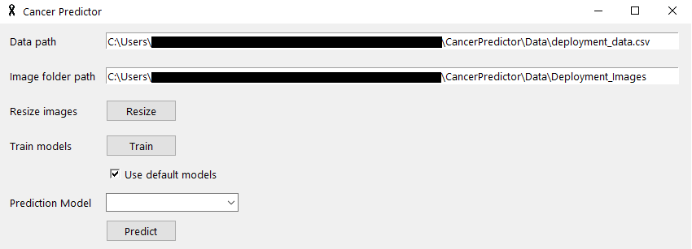

# Skin Cancer Predictor

Highest testing accuracy achieved: 79.1%

***Highest deployment accuracy achieved: 38.0%***

## How to Use
- Specify a .csv file to use as the metadata of the images.

- Specify a folder containing all of your images.

- If using a custom image folder, simply resize the images to the correct resolution by clicking the 'Resize' button.

- If you'd like to train the models on your own metadata and images, you can use the 'Train' button. Note: this may take a long time to complete, and will **OVERWRITE** existing models. Progress can be tracked in the accompanied command window.

- You can choose between using the pre-trained, default models, or your own trained models.

- Select which model you would like to use.

- Click 'Predict' and the resulting predictions will be shown in a new window.

## Getting Started
### How to Install
Clone the repository locally.
Ensure Python 3 is installed, as well as all dependencies, which can be found by the command `$ pip check`.
### How to Run
- Run the included shortcut "Cancer Predictor".
#
_Please contact me or open an issue if you have any issues!_
